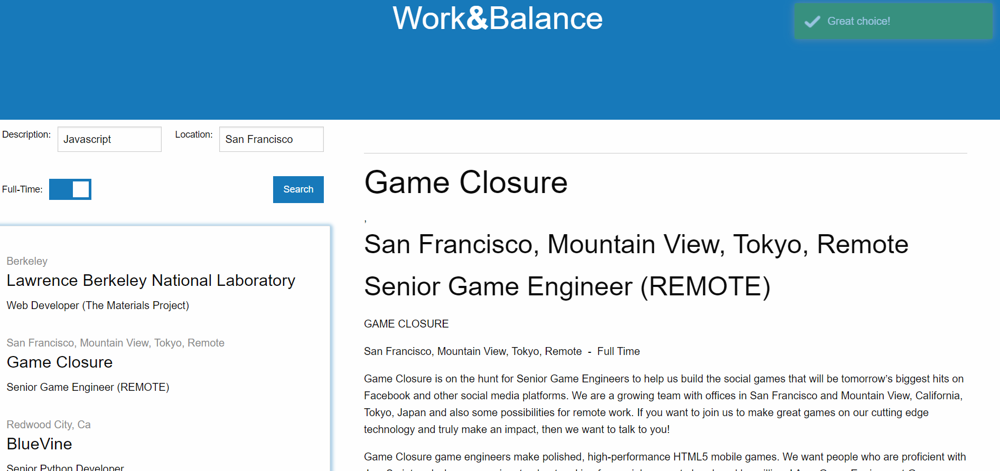
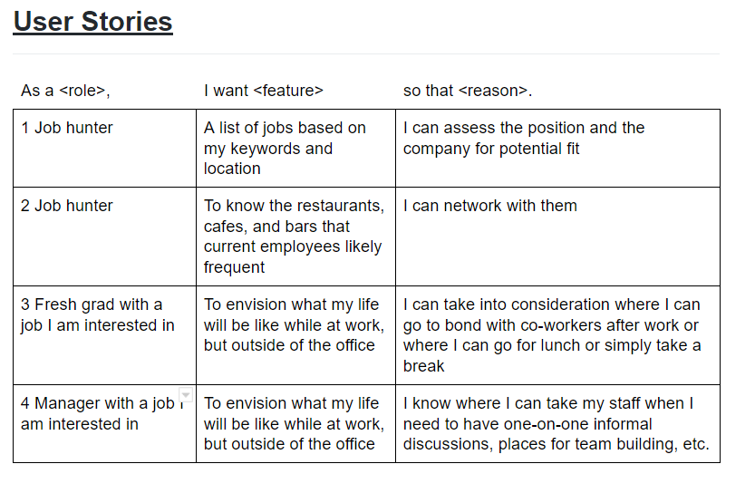

# Work&Balance

## Background
The objective of this project was to work with a team to develop an app that meets the below acceptance criteria while simulating a work-like environment. This was accomplished through usage of Git Hub repositories and branches, agile methodology, and best practices such as morning stand-ups and project boards.

Acceptance criteria was as follows:

```
Must use at least two APIs
Must use AJAX to pull data
Must utilize at least one new library or technology that we haven’t discussed
Must have a polished frontend / UI
Must meet good quality coding standards (indentation, scoping, naming)
Must NOT use alerts, confirms, or prompts (look into modals!)
Must have some sort of repeating element (table, columns, etc)
Must use a CSS framework other than Bootstrap
Must be Deployed (GitHub Pages)
Must have User Input Validation
Must be interactive (i.e: accept and respond to user input)

```

## Site Pictures


## Approach

This project was the first time the authors have worked together on developing an app as a team.

1) Identifying what app to build
2) Identifying and testing APIs
3) Understanding endpoints including inputs and responses
4) Designing the layout
5) Building user stories to understand desired functionality
6) Identifying and incorporating a 3rd party library

### Ideation process - developing an app with purpose and value

Problem / Motivation : Finding a job is more than just about the job itself, it’s also about the quality of life you’ll be spending during your workday.  When considering a new position, candidates often overlook the importance of location and comforts that are easily accessible - in particular, restaurants. In today’s society, many of our most important work-related activities take place outside the office and inside food and beverage destinations - from ideation to ad-hoc meetings/performance reviews and even simple networking and/or team bonding.

### Identifying and testing server-side APIs

There were two kinds of APIs needed for this app: 1) a job posting API and 2) an API that can identify food and beverage establishments within a certain distance from any given location.

The authors used a simple, but effective approach for identifying their chosen APIs:

1) Test the APIs to ensure that jQuery AJAX requests can be succesfully made
2) Analyze sample responses to ensure that the data is in the proper format (JSON) and that relevant data is present
3) Read / understand respective API documentation to ensure that data parsed from one API can be used as inputs in the other

Ultimately, the authors chose to focus on tech related jobs and therefore chose the Git Hub Jobs API to provide job postings.  After careful analysis of several food and beverage specific APIs (Yelp and Zomato), the authors decided to make use of the Google Places API due to its ability to search locations through text inputs, the abundance of fields that can be requested, as well as ease of implementation.  

Unfortunately, both APIs encountered CORS issues and ultimately, the heroku CORS anywhere solution was required to make ajax requests.

Below is a sample of how data from one endpoint was used as inputs for another to make a data request and then how the response is dynamically displayed on the app.  Note the additional nested URL to obtain and display a photo of the selected place:

```
$(document).on("click", ".placeNearby", placesNearby);


    function placesNearby(event) {
        if (event.target.matches("a")) {
            placeName = $(this).attr("data-value");
            console.log($(this).attr("data-value"))
            var test = 123;
            console.log(test);
            console.log("This check: " + placeName);

            var queryPlaceLookupURL = "https://cors-anywhere.herokuapp.com/https://maps.googleapis.com/maps/api/place/findplacefromtext/json?input=" + placeName + "&inputtype=textquery&fields=photos,formatted_address,name,rating,opening_hours,geometry&key=" + googleKey;


            $.ajax({
                url: queryPlaceLookupURL,
                method: "GET",

            }).then(function (response) {
                console.log("Place Nearby Check: " + JSON.stringify(response));
                formatted_address = response.candidates[0].formatted_address;
                name = response.candidates[0].name;
                photos = response.candidates[0].photos[0].photo_reference;
                rating = response.candidates[0].rating;
                placeInfo.push({ address: formatted_address, name: name, photos: photos, rating: rating })

                console.log(placeInfo);

                $("#jobDescriptionEl").html("");
                var placeName = $('<h2 class="work-feature-block-header">' + name + '</h2>');
                var placePhoto = $('');
                placePhoto.attr("src", "https://maps.googleapis.com/maps/api/place/photo?maxwidth=400&photoreference=" + photos + "&key=" + googleKey);
                var placeAddress = $("<p>" + formatted_address + "</p>");
                var placeRating = $("<p>Rating: " + rating + "</p>");

                $("#jobDescriptionEl").append(placeName, placePhoto, placeAddress, placeRating);


            }
            )


        }

    }
```

### Understanding various endpoints

While the GitHub Jobs API was relatively straightforward with only one endpoint utilized, the Google Places API was able to provide much more data and therefore required usage of several different endpoints. Each endpoint provides different data with the added issue of varying costs by data requested. For example, requesting detailed location info such as phone number has a higher cost than basic data such as address.

### Designing the User Interface

The user interface designed by the authors prioritizes functionality. Pertinent information is displayed for the user to consider and details are only displayed when the user makes a selection. Foundation, a responsive front-end CSS framework, was utilized to build the layout.

### All about User Experience

Particular attention was paid to provide a simple, no-frills user experience. Below are the user stories the authors identified and used as a basis for developing this app.



### Incorporating a 3rd party library

The authors considered several different 3rd party libraries to incorporate into the app.  From carousels to modal displays, the authors tested various libraries, but ultimately determined that, while the solutions were visually attractive, they often were detrimental to the overall user experience.  Ultimately, the authors chose to utlize toastr to display a "great choice" message once a job was clicked on.  This was done as a means to acknowledge to the user that a click was registered as there can be a lag between the time a job is clicked and when its details are displayed.

## Built With

* [HTML](https://developer.mozilla.org/en-US/docs/Web/HTML)
* [CSS](https://developer.mozilla.org/en-US/docs/Web/CSS)
* [Foundation](http://foundation.zurb.com/)
* [JS](https://developer.mozilla.org/en-US/docs/Web/JavaScript)
* [jquery](https://jquery.com/)
* [toastr](https://github.com/CodeSeven/toastr)
* [GitHub Jobs API](https://jobs.github.com/api)
* [Google Places API](https://developers.google.com/places/web-service/intro)
* [Heroku CORS Anywhere](https://cors-anywhere.herokuapp.com/)

## Deployed Link

* [See Live Site](https://seyouny.github.io/JobSearchEateries/)


## Authors

* **Seyoung Yoon**
* **Lala Tuiolosega**
* **CHRISTOPHER LEE** 

- [Link to Github - Seyoung Yoon](https://github.com/seyouny)
- [Link to Github - LaLa Tuiolosega](https://github.com/ltuiolosega)
- [Link to Github - Christopher Lee](https://github.com/CofChips)


- [Link to LinkedIn - Seyoung Yoon](https://www.linkedin.com/in/stacey-yoon-bbaa7413a/)
- [Link to LinkedIn - LaLa Tuiolosega](https://www.linkedin.com/in/lala-tuiolosega/)
- [Link to LinkedIn - Christopher Lee](https://www.linkedin.com/in/christophernlee/)

## Acknowledgments